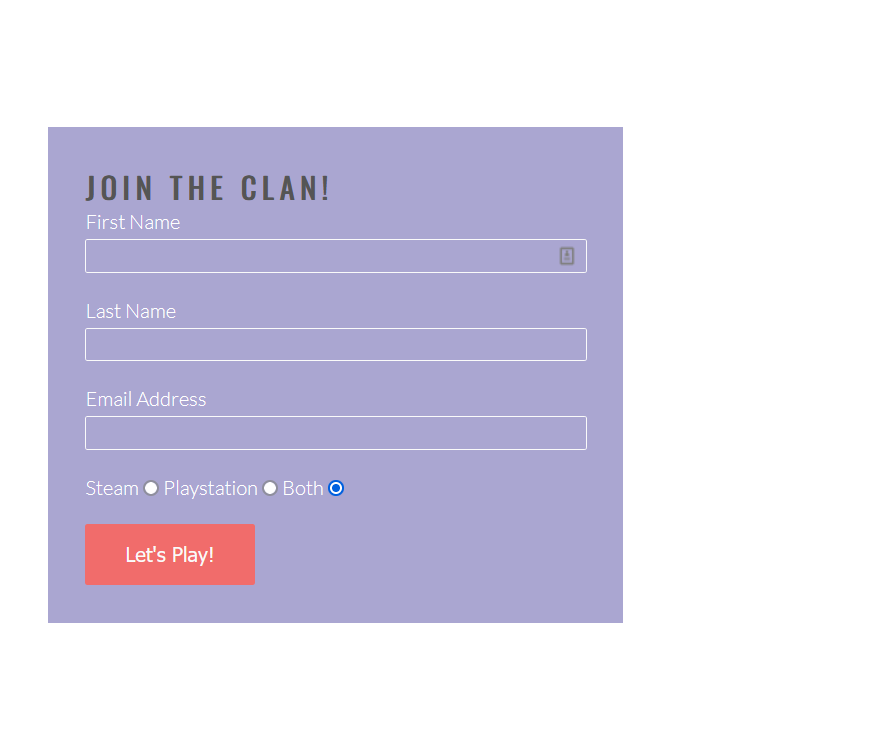

# This is the one lads

This is the one lads is a sites that helps existing  clan members to arrange co-op sessions in the game Destiny 2. It also enables new people to request to join the clan in order play with more
experienced clan members

## Features 

- __Navigation Bar__

  - Featured on all three pages, the full responsive navigation bar includes links to the  Home page, Gallery and Sign Up page and is identical in each page to allow for easy navigation.
  - This section will allow the user to easily navigate from page to page across all devices without having to revert back to the previous page via the ‘back’ button. 

- __The landing page image__

  - The landing includes a photograph with text overlay to allow the user to see exactly to whom this site would be applicable to. 
  - This section introduces the user to This is the one lads  with an eye catching animation of the Destiny2 logo to grab their attention.

- __Club Ethos Section__

  - The clan ethos section will allow the user to see the benefits of joining the clan. 
  - This user will see the value of signing up for This is the one lads in order to enjou the full Destiny2 experience.

- __Meetup Times section__

  - This section will allow the user to see exactly when the different in-game avtivities will happen and what we will be doing together. 
  - This section will be updated as game content changes to keep the user up to date. 

- __The Footer__ 

  - The footer section includes links to the relevant social media sites for Love This is the one lads. The links will open to a new tab to allow easy navigation for the user. 
  - The footer is valuable to the user as it encourages them to keep connected via social media

- __Gallery__

  - The gallery will provide the user with supporting images to see what Destiny2 look like. 
  - This section is valuable to the user as they will be able to easily identify the types of activities and features available in the game. 

- __The Sign Up Page__

  - This page will allow the user to get signed up to This is the one lads to start playing  with the clan. The user will be able specify if they would like to play on Playsation, Steam or both.   The user will be asked to submit their full name and email address.

### Features Left to Implement

- Add a looking for group(LFG) section, where users can select a specific ativity at preferred time.

## Testing 

The site was tested in Firefox and Google Chrome at varying screen sizes using dev tools

 

The site remains responive across multiple screen sizes

On smaller screen sizes the hero image appeared streched and pixelated. I found a solution using css background on Stackoverflow. Link in credit sections

The gallery images were not displaying properly on smalller screens. Found a  solution on Youtube using a flexbox. Link in credit section.

### Validator Testing 

- HTML
  - No errors were returned when passing through the official [W3C validator](https://validator.w3.org/nu/?doc=https%3A%2F%2Fcode-institute-org.github.io%2Flove-running-2.0%2Findex.html)
- CSS
  - No errors were found when passing through the official [(Jigsaw) validator](https://jigsaw.w3.org/css-validator/validator?uri=https%3A%2F%2Fvalidator.w3.org%2Fnu%2F%3Fdoc%3Dhttps%253A%252F%252Fcode-institute-org.github.io%252Flove-running-2.0%252Findex.html&profile=css3svg&usermedium=all&warning=1&vextwarning=&lang=en#css)

## Deployment

This section should describe the process you went through to deploy the project to a hosting platform (e.g. GitHub) 

- The site was deployed to GitHub pages. The steps to deploy are as follows: 
  - In the GitHub repository, navigate to the Settings tab 
  - From the source section drop-down menu, select the Master Branch
  - Once the master branch has been selected, the page will be automatically refreshed with a detailed ribbon display to indicate the successful deployment. 

The live link can be found here - https://code-institute-org.github.io/love-running-2.0/index.html 

## Credits 

### Content 

- The structure for the home page was taken from the Love Running tutorial
- Instructions on how to implement the flexbox on the gallery page was taken from [Cem Eygi Media](https://www.youtube.com/watch?v=QmZNFnqwu74&ab_channel=CemEygiMedia)
- The icons in the footer were taken from [Font Awesome](https://fontawesome.com/)
- The fix for the hero image pixelation was found on [Slack Overflow](https://stackoverflow.com/questions/64563675/best-method-for-making-hero-image-fill-entire-screen-on-mobile-without-ruining-q)
### Media

- The photos used on the home and sign up page are from [Alphacoders](https://wall.alphacoders.com/profile.php?id=68995 footer image citation: https://wall.alphacoders.com/big.php?i=917700)
- The images used for the gallery page were taken by me in game.

